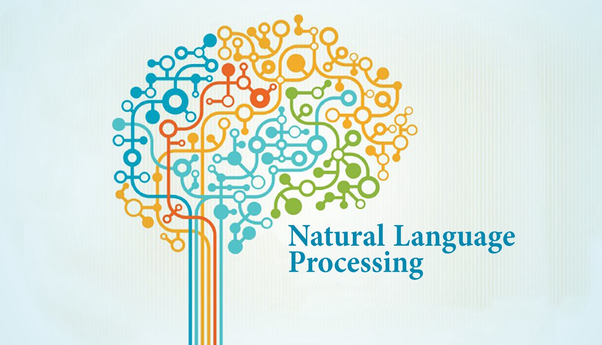

# Natural_Language_Processing

Natural Language Processing is a field in machine learning with the ability of a computer to understand, analyze, manipulate, and potentially generate human language.
